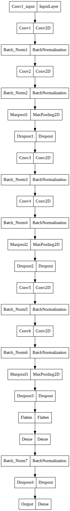

# Mood Analysis

## Motivation and Goal

The goal of the project is to provide an application, which is able to analyse images and compute an emotion, if the
image includes a face.


* * *

## Deployment 

### Docker

There is a  [Dockerfile](Dockerfile) and a [docker-compose.yml](docker-compose.yml) located in the root dir.

```Bash
# build docker image
docker-compose build

# start docker-compose setup in background
docker-compose up -d  
```


## Implementation 

The application uses a neural network, which is included compiled as a [model](models/emotions_final.h5). 
It is based on [jupyter notebook](models/emotions_detection.ipynb).

### Structure of the neural network 



### WebApp 

To demonstrate the purpose, there is a WebbApplication build around the model. 
It allows two different sources: uploading an Image, and interactively recording a Video through the WebApp.

## Credits & Collaborators

### Collaborators

- [Dennis Hug](https://github.com/hugson-d)
- [Laurin Leiwes](https://github.com/NighthawkF119)
- [Moritz Moser](https://github.com/Pondo18)